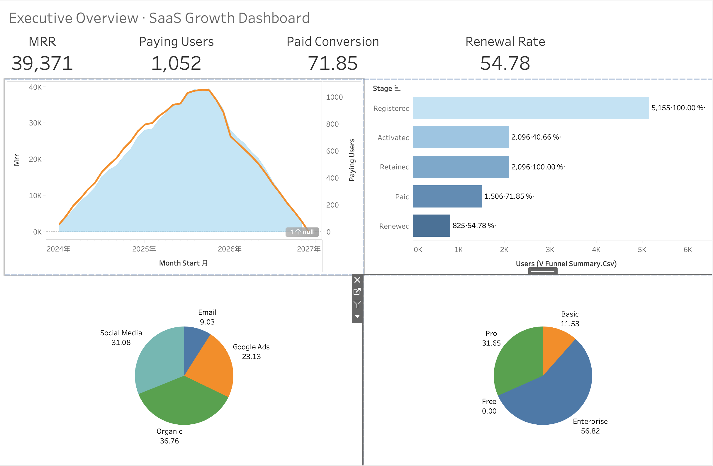
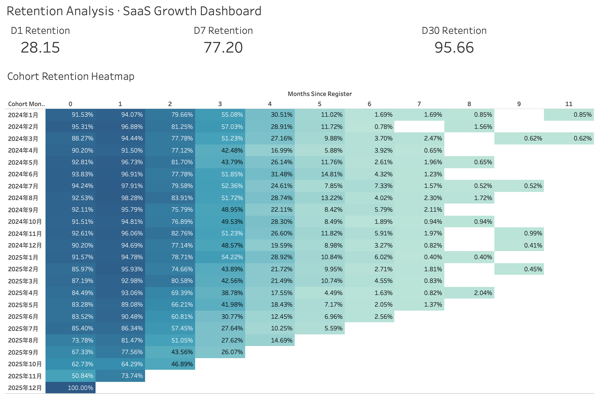
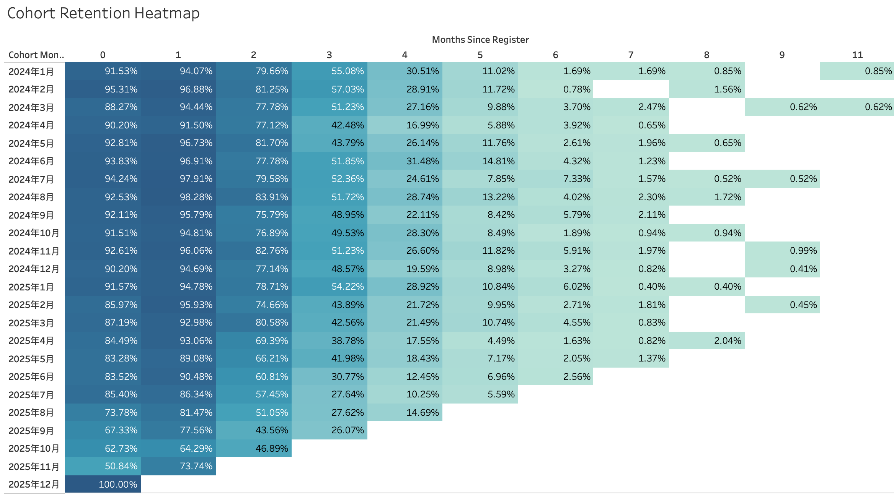

# SaaS 用户增长与经营分析

围绕一家虚拟的 SaaS 设计协作工具，做了一遍完整的经营数据分析：
从数据建模开始，到 SQL 写各类指标，再到 Tableau 看板规划。

## Dashboards

> 以下为本地 Tableau Desktop 搭建并截图的看板，暂未发布到 Tableau Public。
> 当前已完成 2 个看板，另外 2 个为后续补充项。

### Dashboard 1 — Executive Overview （已完成）

面向高管的整体经营概览：MRR 趋势 + 漏斗 + 渠道 / 套餐收入占比。



### Dashboard 3 — Retention Analysis （已完成）

面向产品团队的留存分析：Cohort 热力图（核心）+ 分群留存对比。



#### Cohort 留存热力图（特写）



### 后续补充

- **Dashboard 2 — Acquisition & Funnel**：分渠道新增 + 5 段漏斗 + 渠道质量散点（🔜 Roadmap）
- **Dashboard 4 — Revenue & Customer Health**：MRR/ARR 趋势 + Pareto 集中度 + Top 客户（🔜 Roadmap）

4 个看板的完整布局规划和搭建步骤见 [`docs/tableau_build_guide.md`](docs/tableau_build_guide.md)。

## 项目背景

最近在系统学 SaaS / PLG 方向的经营分析方法，看了一些公开框架（Reforge、Lenny's Newsletter 这一类），
但能找到的 demo 项目要么数据太干净、不真实，要么只覆盖单一指标。
所以自己造了一份"接近真实业务"的数据集，把 SaaS 里一些常见的业务规律
（不同获客渠道的用户质量差异、套餐与活跃度的关系、企业 vs 个人用户的行为差异）
写进数据生成逻辑里，再以一个数据分析师的视角去回答几个核心问题：

- 用户增长是健康的吗？
- 用户留下来用了吗？还是注册完就消失？
- 收入主要来自哪里？是稳定的吗？
- 漏斗里哪一步流失最严重？

目标不是写一堆 SQL 炫技，而是练习"看业务数据 → 提对的问题 → 落到可执行结论"
这一套完整过程。

## 技术栈

Python (pandas / numpy) 做数据生成 · DuckDB 做本地分析仓库 · SQL 做核心分析 · Tableau 做可视化

## 项目结构

```
saas-growth-analysis/
├── data/                CSV + DuckDB 数据库（由脚本生成，不入 git）
├── python/              数据生成 / 导入 / 导出脚本
├── sql/                 4 个分析模块（增长 / 留存 / 收入 / 漏斗）
├── tableau/             供 Tableau 使用的 CSV（由脚本生成，不入 git）
├── docs/                项目文档（数据字典 / 指标定义 / 看板搭建指南）
└── README.md
```

三张事实表：`users`（用户主数据）· `activity`（行为日志）· `subscription`（订阅付费）。
完整字段说明见 [`docs/data_dictionary.md`](docs/data_dictionary.md)。

## 快速运行

```bash
pip install -r requirements.txt
```

项目按以下顺序运行——每一步依赖前一步的产物：

```bash
# 1. 生成模拟数据 (CSV → data/)
python python/generate_data.py

# 2. CSV 导入 DuckDB + 完整性校验
python python/load_to_duckdb.py

# 3. 运行 SQL 分析（任选其一）：
duckdb data/saas_analysis.duckdb < sql/01_user_growth_analysis.sql
# 或在 Python 里：
#   con = duckdb.connect('data/saas_analysis.duckdb')
#   con.execute(open('sql/01_user_growth_analysis.sql').read())

# 4. 导出 9 个 BI 视图为 CSV（供 Tableau 等使用）
python python/export_views_to_csv.py
```

## 分析模块

| 模块 | 想回答的问题 | 主要指标 |
|---|---|---|
| 增长分析 | 用户在涨吗？怎么涨的？ | DAU / WAU / MAU, MoM, 渠道新增趋势 |
| 留存分析 | 用户留下来了吗？哪些 cohort 在变好？ | D1 / D7 / D30, Cohort 矩阵 |
| 收入分析 | 钱从哪儿来，能否持续？ | MRR / ARR, ARPU / ARPPU, 收入集中度 |
| 漏斗分析 | 在哪一步流失最多？ | 注册 → 激活 → 留存 → 付费 → 续费 |

每个模块的 SQL 按"先看整体指标 → 再按维度切片 → 最后落成 Tableau 可用的视图"组织。
所有指标的精确口径、计算公式、以及与真实业务实现的差异说明，见
[`docs/metric_definitions.md`](docs/metric_definitions.md)。

## 关键结果

> 数据可复现：`generate_data.py` 固定随机种子 `seed=42`，5500 用户、约 5.9 万条行为、8 千余条订阅。

| 维度 | 关键数字 | 业务含义 |
|---|---|---|
| 漏斗最大瓶颈 | 注册 → 激活仅 **40.7%** | 约六成新用户从未激活，onboarding 优化 ROI 高于继续投流 |
| 激活的价值 | 激活组 8–30 天留存显著高于未激活组 | 印证 PLG「激活才是真正的北极星」 |
| 收入集中度 | Enterprise 贡献 **56.8%** 收入（仅 506 个用户） | 典型 ToB 集中结构，大客户是收入命脉 |
| 续费风险 | Enterprise 续费率最低（**29%**），Basic 最高（**56%**） | 大客户收入高但黏性最弱，是续费风险点 |
| 渠道质量 | Organic 最优 / Email 最差（激活率仅 **20%**） | 市场预算应向自然流量倾斜，Email 渠道需复盘 ROI |
| 商业化效率 | ARPPU $271 vs ARPU $138 | Free 用户拉低整体效率，看付费效率应用 ARPPU |

> 说明：本项目为个人模拟数据集，价值在于完整的分析方法论与口径严谨性，而非数字绝对值。
> 部分指标（如 MRR）受 schema 限制为近似口径，详见 [`docs/metric_definitions.md`](docs/metric_definitions.md)。

## 主要发现

- **激活是 SaaS 漏斗里最关键的一步。** 把"首周 ≥ 3 次活动"作为激活阈值之后，
  激活用户的付费率明显高于未激活用户，和 PLG 文献里常说的
  "激活才是 SaaS 的真正北极星"是吻合的。

- **不同获客渠道的用户质量分层明显。** Organic 和 Social Media 进来的用户，
  在留存、付费、续费三个环节都好于付费广告渠道；Email 渠道在所有维度上都垫底。
  这提示市场预算的优先级应该向自然流量倾斜，付费投放需要回头看 ROI。

- **收入呈现典型的 ToB SaaS 集中结构。** Enterprise 用户规模较小，
  但贡献了主要收入；Pro 套餐是中间的稳定贡献者；
  Basic 单价低，续费率反而最高，更像稳定的现金奶牛。

- **最大的漏斗瓶颈在"注册 → 激活"之间。** 大约六成新注册用户从未越过激活阈值，
  这一段是产品 onboarding 最应该优化的地方，ROI 大概率高于继续投流量。

- **Cohort 留存呈现 SaaS 典型的指数衰减。** 注册后 1-2 个月最活跃，
  第 3 个月左右出现明显分水岭，跨过这一段的用户进入长尾留存。

## 关于数据

数据是模拟生成的，但不是简单随机。生成时把渠道、设备、套餐与用户行为之间的相关性
写成了显式的权重，比如：

- Organic 用户的活跃度权重高于 Email 用户
- Enterprise 用户的 session 时长和页数都更高
- Desktop 用户中企业用户占比更高

在做留存和漏斗分析的过程中，发现初版数据的 Cohort 曲线与真实 SaaS 产品规律不太一致
（活动被均匀撒在了用户整个生命周期上，导致首月活跃偏低、长尾偏高）。
于是回头调整了行为时间分布的逻辑，让活动更集中在注册后的 1-2 个月，
使 Funnel 和 Cohort 更贴近真实 SaaS 行为。

这一段也让我意识到：跑完 SQL 拿到数字以后，要先用业务常识做一次 sanity check，
不能直接拿数据当结论。

## Tableau 看板（完整规划）

截图见本 README 顶部 Dashboards 区。下表是 4 个看板的完整规划，已完成 2 个，
另外 2 个为后续补充项。

| 看板 | 受众 | 主要图表 | 状态 |
|---|---|---|---|
| Executive Overview | CEO / 高管 | MRR 趋势 + 漏斗 + 渠道 / 套餐收入占比 | ✅ 已完成（本地 Tableau） |
| Acquisition & Funnel | Growth / Marketing | 分渠道新增 + 5 段漏斗 + 渠道质量散点 | 🔜 Roadmap |
| Engagement & Retention | 产品团队 | Cohort 热力图（核心）+ 分群留存对比 | ✅ 已完成（本地 Tableau） |
| Revenue & Customer Health | CFO / CS | MRR/ARR 趋势 + Pareto 集中度 + Top 客户 | 🔜 Roadmap |

**说明：**

- 9 个 BI 视图通过 `export_views_to_csv.py` 导出到 `tableau/`，可直接连 Tableau
- 4 个看板的布局规划和手把手搭建步骤见 [`docs/tableau_build_guide.md`](docs/tableau_build_guide.md)
- 视图到看板的映射见 `tableau/_manifest.csv`
- 当前展示的截图都来自本地 Tableau Desktop；暂未发布到 Tableau Public

## 文档导航

- [数据字典](docs/data_dictionary.md) — 三张表的字段、取值、业务含义
- [指标定义](docs/metric_definitions.md) — DAU/WAU/MAU、Retention、MRR/ARPU、Funnel 等口径
- [Tableau 搭建指南](docs/tableau_build_guide.md) — 4 个 Dashboard 的逐步搭建步骤

## 用到的主要 SQL 技术

窗口函数（LAG / NTILE / 累计 SUM）· DATE_TRUNC + INTERVAL 算术 · generate_series 生成日历 · CTE 链式 + EXISTS 标志位 · PIVOT 宽表 · 视图物化

## Roadmap

- [x] 数据建模 + 4 个分析模块 SQL
- [x] BI 视图 + Tableau CSV 导出
- [x] Dashboard 1 (Executive Overview) + Dashboard 3 (Retention) 本地搭建 + 截图
- [ ] Dashboard 2 (Acquisition & Funnel) + Dashboard 4 (Revenue & Customer Health)
- [ ] 用 Jupyter 补一份探索性数据分析（matplotlib）
- [ ] 试着用 dbt 重写视图，加上数据测试

后续如果有时间，会接着做 CAC / LTV 建模、付费用户分层运营策略、以及一个简易的流失预警模型。
